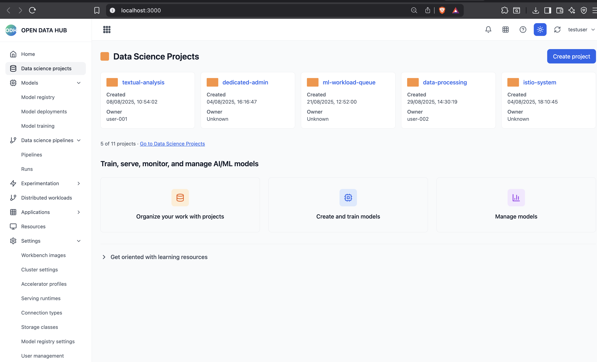
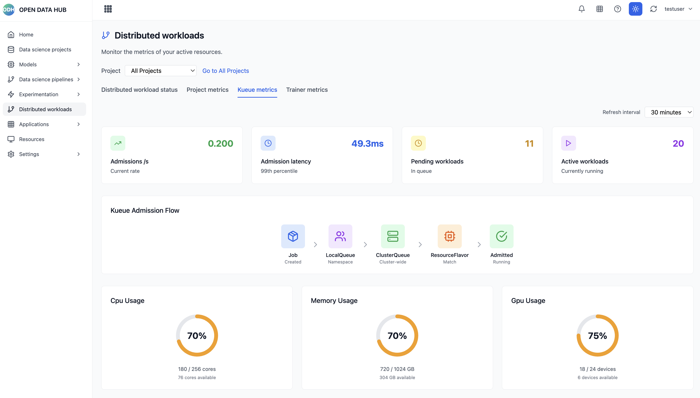
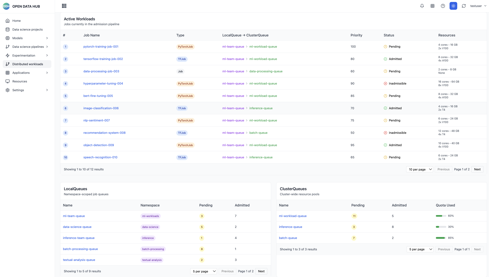
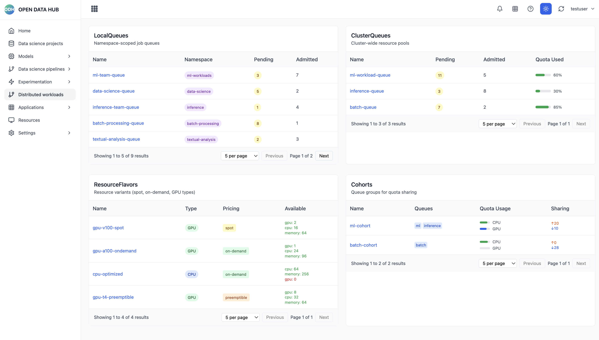
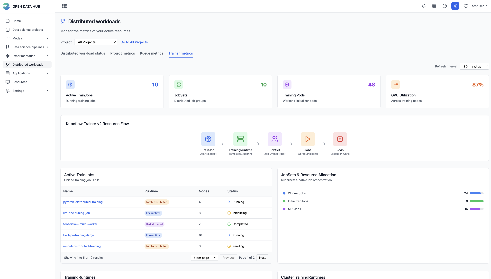
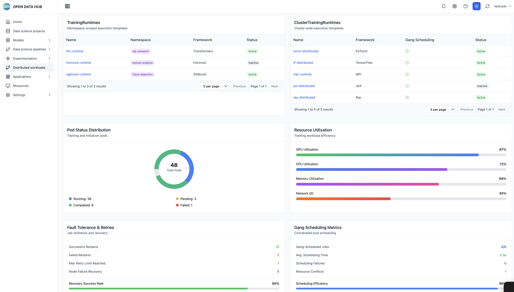
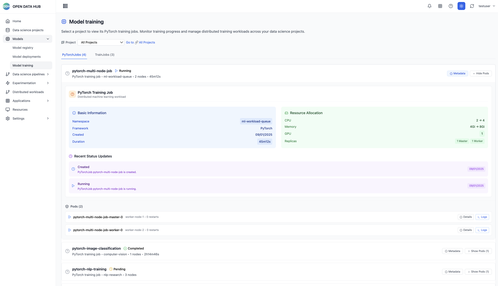
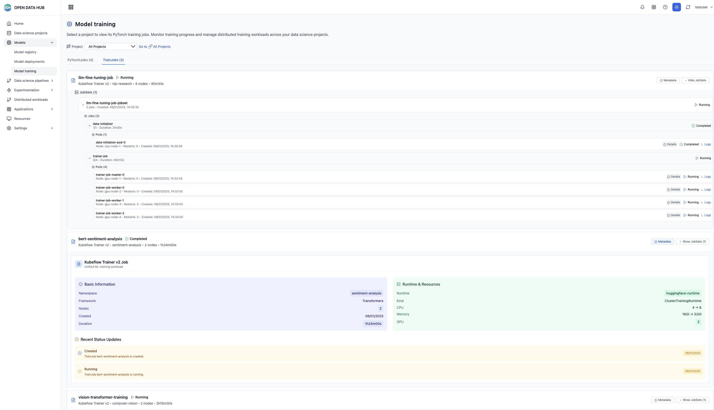

# Open Data Hub Dashboard Prototype

A React-based dashboard for Open Data Hub featuring comprehensive Kueue and Kubeflow Trainer v2 metrics visualization.



## Features

### Kueue Metrics Dashboard
Comprehensive visualization of Kueue workload management with namespace-scoped filtering:


*Kueue workload status overview with admission flow visualization*


*Resource flavors, cohorts, and cluster queue management*


*Local and cluster queue details with pagination*

### Kubeflow Trainer v2 Metrics Dashboard
Advanced metrics for Kubeflow Trainer v2 with TrainJob and runtime management:


*Trainer v2 overview with TrainJob status and resource flow*


*Separate TrainingRuntimes and ClusterTrainingRuntimes management*

### Model Training Dashboard
Hierarchical view of PyTorchJobs and TrainJobs with detailed metadata and pod inspection:


*PyTorchJob hierarchical view with expandable pods and structured metadata*


*TrainJob hierarchical view with JobSets, Jobs, and Pod drill-down capabilities*

## Getting Started

### Install dependencies
```bash
npm install
```

### Start development server
```bash
npm run dev
```

### Build for production
```bash
npm run build
```